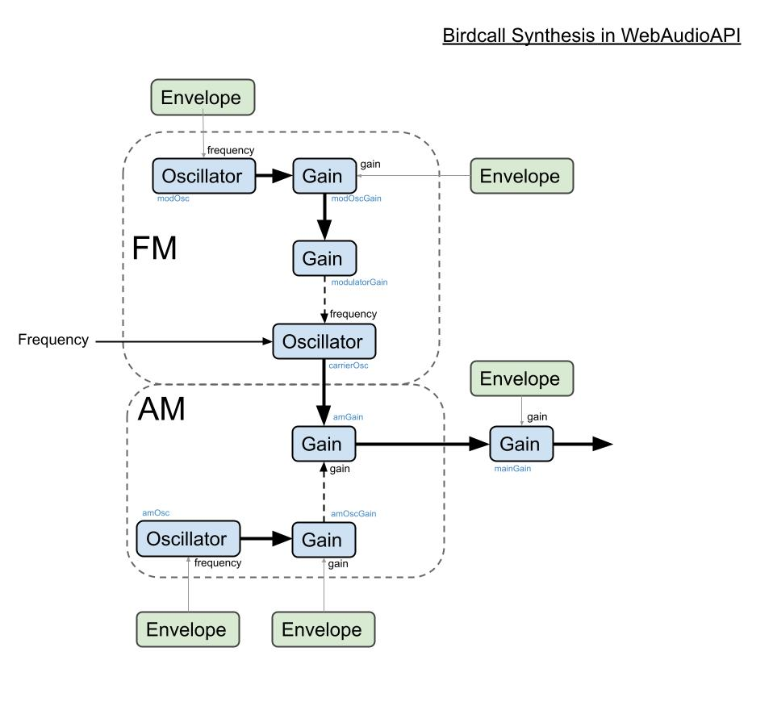

birds
=====

## What ?

WebAudioAPI based Birdcall Synthesis based on AM+FM using ideas from  [Start from Birdcall synthesis - Andy Farrell](http://obiwannabe.co.uk/tutorials/html/tutorial_birds.html).

Here is a brief overview of the structure of the connections.

## Where ?

Play with the model [here](http://notthetup.github.io/birds). Only works on Chrome and Safari for now. FF has some funky bugs.

## Why ?

Because birds!

## How ?

1. Magic
2. [WebAudioAPI](http://webaudio.github.io/web-audio-api/)
3. [Synthesis](https://ccrma.stanford.edu/software/snd/snd/fm.html)
